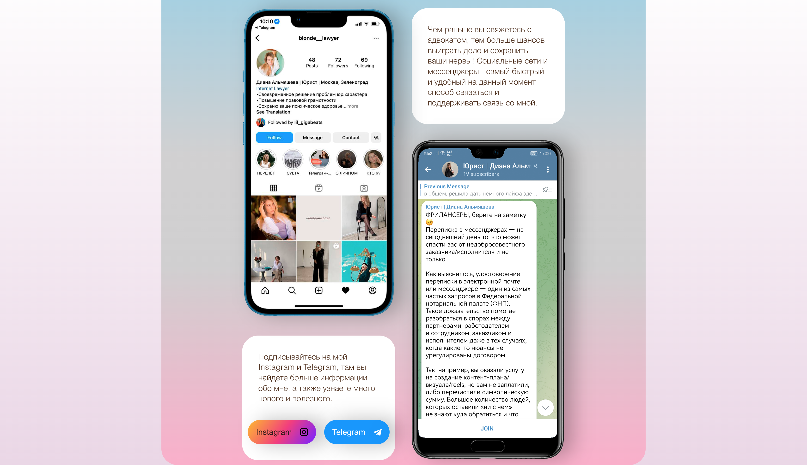

# Site landing
#### for the customer laywer A.Diana.
The site is a single-page React application - an application with layout for the screens of various devices. 

## Adaptation support for ultra-wide screens, laptop screens and mod devices.
The following viewport values ​​are currently supported:
* min-width: 1024px
* max-width: 1024px
* max-width: 767px

## Technology stack:
1. React
2. Vite
3. TypeScript
4. Formik
5. Yup 
6. React slick

## Preview

## [Go](https://di-lawyer-landing-o05fax77f-gigabyte1511.vercel.app/ "Необязательная подсказка") to the Versel environments to see one of the versions of the application
